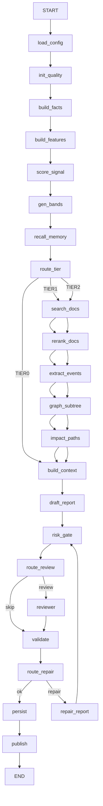

# AGENT_WORKFLOW_LANGGRAPH.md

- Version: 0.1
- Status: Draft
- Last Updated: 2026-02-09 (America/Los_Angeles)
- Depends on:
  - `SCHEMA.md`（Report 输出 JSON Schema）
  - `TOOLS_SPEC.md`（Tools/Skills 合约）

> 目标：用 LangGraph 把“拉数据 → 特征/评分 → 检索/图谱/记忆增强 → LLM 结构化报告 → 风控门禁 → 复核 → Schema 校验与修复 → 落库/写记忆”串成可回放、可降级、可观测的工作流。

---

## 1. 为什么用 LangGraph（你会用到的能力）
- **StateGraph**：用共享 state 连接多个节点（每个节点读 state、返回 Partial<State> 更新）。 :contentReference[oaicite:2]{index=2}  
- **Conditional edges**：用 routing function 决定下一步走哪些节点（按 tier/预算/数据质量/风险情况做路由）。 :contentReference[oaicite:3]{index=3}  
- **并行分支**：一个节点可有多个 outgoing edges，下一 superstep 并行执行多个节点；注意 state merge 需要 reducer 或写不同 key。 :contentReference[oaicite:4]{index=4}  
- **Persistence / Threads / Checkpoints**：编译图时加 checkpointer，会在每个 superstep 保存 checkpoint 到 thread，可用于回放、容错、HITL、time-travel。 :contentReference[oaicite:5]{index=5}  
- **Interrupts（可选）**：在关键动作（如 BUY/推送/写入关键结论）前插入人工审批点。 :contentReference[oaicite:6]{index=6}  

---

## 2. 工作流总览（v0.1）

### 2.1 主流程（顺序 + 条件分支）
1) Load Config（策略版本、权重、风控）  
2) Build Facts（行情/财务/资金/宏观快照）  
3) Build Features（拼 feature_vector）  
4) Deterministic Scoring（score_signal）  
5) Generate Price Bands（generate_price_bands）  
6) Memory Recall（retrieve_memory_notes）  
7) (Tier>=1) RAG：search_event_docs → rerank_docs → extract_events  
8) (Tier>=1) Graph：query_supply_chain_subtree + find_impact_paths + compute_exposure_score  
9) Context Pack（把事实/评分/事件/图谱/记忆压成 LLM 可用上下文）  
10) Draft Report（LLM 结构化输出 Report JSON）  
11) Risk Gate（硬风控门禁裁决 + 可能降级 action/仓位）  
12) (Tier2 或高风险) Reviewer（第二模型/规则复核）  
13) Validate（validate_report_schema + consistency_check）  
14) Repair Loop（最多 N 次：修复后再校验）  
15) Persist（写 report、写 memory、写 trace）  
16) Publish（返回给 UI / 触发告警）

---

## 3. State Schema（TypedDict）

> 原则：**state 尽量小**。大对象（全文/长文档/原始快照）落库，只在 state 存 ID + 关键摘要字段，避免 checkpoint 过大。

### 3.1 类型定义（建议放在 `app/workflows/state.py`）

```python
from __future__ import annotations
from typing import TypedDict, Literal, Optional, List, Dict, Any

Tier = Literal["TIER0", "TIER1", "TIER2"]
RunMode = Literal["LIVE", "SHADOW", "BACKTEST"]
Action = Literal["BUY", "WATCH", "AVOID"]

class BudgetState(TypedDict, total=False):
    max_tool_calls: int
    tool_calls_used: int
    max_cost_usd: float
    cost_usd_est: float
    degraded: bool
    degrade_reasons: List[str]

class DataQualityState(TypedDict, total=False):
    status: Literal["OK", "DEGRADED", "PARTIAL"]
    missing_fields: List[str]
    notes: str

class StrategyConfig(TypedDict, total=False):
    strategy_version_id: str
    weights: Dict[str, float]
    weights_hash: str
    risk_profile: Dict[str, Any]  # max_volatility/max_drawdown/max_position_pct/...
    time_horizon: Literal["INTRADAY", "SWING", "POSITION"]

class SnapshotRefs(TypedDict, total=False):
    market_snapshot_id: str
    fundamentals_snapshot_id: str
    flow_snapshot_id: str
    macro_snapshot_id: str

class SignalScore(TypedDict, total=False):
    raw_score: float
    score_0_100: int
    top_contributors: List[Dict[str, Any]]

class PriceBandSkeleton(TypedDict, total=False):
    band_id: str
    min: float
    max: float
    label: str

class DocMeta(TypedDict, total=False):
    doc_id: str
    title: str
    source: str
    published_at: str
    snippet: str
    uri: str

class ExtractedEvent(TypedDict, total=False):
    event_id: str
    type: str
    entities: List[str]
    direction: str
    confidence: float
    summary: str
    evidence_doc_ids: List[str]

class GraphSubtree(TypedDict, total=False):
    graph_id: str
    nodes: List[Dict[str, Any]]
    edges: List[Dict[str, Any]]

class ImpactPath(TypedDict, total=False):
    path_id: str
    paths: List[Dict[str, Any]]

class ExposureScore(TypedDict, total=False):
    entity: str
    exposure_score: float
    explanation: str

class ValidationResult(TypedDict, total=False):
    valid: bool
    errors: List[str]

class ConsistencyResult(TypedDict, total=False):
    ok: bool
    warnings: List[str]
    hard_failures: List[str]

class RetryState(TypedDict, total=False):
    repair_attempts: int
    max_repairs: int
    last_repair_reason: str

class ResearchState(TypedDict, total=False):
    # Request context
    ticker: str
    market: Optional[str]
    asof: str
    tier: Tier
    run_mode: RunMode

    # Config & budget
    config: StrategyConfig
    budget: BudgetState

    # Facts & quality
    snapshots: SnapshotRefs
    data_quality: DataQualityState

    # Features & scoring
    feature_vector: Dict[str, float]
    signal_score: SignalScore
    price_bands: List[PriceBandSkeleton]

    # Memory
    memory_notes: List[Dict[str, Any]]  # keep short summaries only

    # RAG
    doc_candidates: List[DocMeta]
    ranked_doc_ids: List[str]
    extracted_events: List[ExtractedEvent]

    # Graph
    graph_subtree: Optional[GraphSubtree]
    impact_paths: List[Dict[str, Any]]
    exposure_scores: List[ExposureScore]

    # LLM report
    report_draft: Dict[str, Any]
    report_after_risk_gate: Dict[str, Any]
    reviewer_notes: List[str]

    # Validation / repair
    validation: ValidationResult
    consistency: ConsistencyResult
    retry: RetryState

    # Final
    final_report: Dict[str, Any]
    persist_refs: Dict[str, str]  # report_id, memory_note_id, trace_id, ...
````

---

## 4. 节点设计（Nodes）

> 节点输入：`state`
> 节点输出：`Partial<State>`（只返回需要更新的 key）
> 失败策略：返回 `{"data_quality": {...}, "budget": {...}}` 标记降级，不要沉默失败。

### 4.1 Config / Budget

#### Node: `load_strategy_config`

* 读取 `strategy_version_id` 对应的权重与风控参数，计算 `weights_hash`
* 初始化 `budget`（max_tool_calls/max_cost_usd/max_repairs）
* 输出：

  * `config`
  * `budget`
  * `retry`

#### Node: `init_data_quality`

* 初始化 `data_quality={status:"OK", missing_fields:[]}`

---

### 4.2 Facts & Features

#### Node: `build_facts`

* 调用工具：

  * `get_market_snapshot`
  * `get_fundamentals_snapshot`
  * `get_flow_sentiment_snapshot`
  * `get_macro_commodity_logistics_snapshot`（tier>=TIER1 才调用）
* 输出：

  * `snapshots`（保存 snapshot_id）
  * 合并各工具返回的 `data_quality`，若缺失关键字段，提升为 `DEGRADED/PARTIAL`

> 可选并行：把四个快照拆成四个节点并行拉取，然后 merge；但并行时注意 state key 冲突与 reducer。

#### Node: `build_features`

* 读取快照（通常从 DB 或缓存拿小摘要）
* 输出 `feature_vector`（你定义的特征字典）
* 如果缺失严重，写入 `data_quality.missing_fields`

---

### 4.3 Deterministic Scoring & Bands

#### Node: `score_signal_node`

* 调用 `score_signal(feature_vector, weights)`
* 输出 `signal_score`

#### Node: `generate_price_bands_node`

* 调用 `generate_price_bands`
* 输出 `price_bands`（骨架：min/max/label）

---

### 4.4 Memory Recall

#### Node: `retrieve_memory_node`

* 调用 `retrieve_memory_notes(ticker, query, top_k, time_range_days)`
* query 建议：`"{ticker} 关键风险 催化 证伪 结论"`
* 输出 `memory_notes`（只保留 summary/tags/importance/links）

---

### 4.5 RAG（仅 Tier1/2）

#### Node: `search_docs_node`

* 条件：tier>=TIER1 且 budget 允许
* 调用 `search_event_docs`（建议多 query：ticker/公司名/主业关键词/主题词/产业链关键词）
* 输出 `doc_candidates`

#### Node: `rerank_docs_node`

* 条件：doc_candidates 非空
* 调用 `rerank_docs(query, docs, top_k=8)`
* 输出 `ranked_doc_ids`

#### Node: `extract_events_node`

* 条件：ranked_doc_ids 非空
* 调用 `extract_events_from_docs(top_docs)`
* 输出 `extracted_events`

---

### 4.6 Graph Enrichment（仅 Tier1/2）

#### Node: `graph_subtree_node`

* 条件：tier>=TIER1
* 调用 `query_supply_chain_subtree(ticker, depth)`（TIER1: depth=2；TIER2: depth=3）

#### Node: `impact_paths_node`

* 条件：存在 extracted_events 且事件类型属于 COMMODITY/LOGISTICS/POLICY/GEOPOLITICS 等
* 对 top-N entities：

  * 调用 `find_impact_paths(ticker, entity)`
  * 调用 `compute_exposure_score(ticker, entity)`
* 输出：

  * `impact_paths`
  * `exposure_scores`

---

### 4.7 Context Pack & LLM Draft

#### Node: `build_context_pack_node`

* 将以下信息压缩成“LLM 可用上下文”：

  * signal_score.top_contributors（为什么分数高/低）
  * price_bands（段位骨架 + 风控提示）
  * extracted_events（结构化事件列表）
  * exposure_scores / impact_paths（图谱传导）
  * memory_notes（历史结论/被证伪点）
  * data_quality（缺失提示：LLM 不得编造）

> 输出可以写进 `state["context_pack"]`（如需），或直接在 `draft_report_node` 内部构造 prompt。

#### Node: `draft_report_node`

* 调用主模型（云端强模型）生成 `Report` JSON（必须符合 `SCHEMA.md`）
* 输出 `report_draft`

> 注意：LLM 生成时强制：
>
> * `evidence_refs` 必须引用到 snapshot_id/doc_id/path_id（避免“无证据断言”）
> * `data_quality` 必须反映真实缺失
> * `price_bands` 要结合 deterministic 的 bands（LLM 只解释/给条件，不应改动 min/max）

---

### 4.8 Risk Gate（硬门禁）

#### Node: `risk_gate_node`

* 调用 `risk_gate(proposed_action, score, risk_profile, risk_metrics)`
* 可能修改：

  * action（BUY→WATCH/AVOID）
  * positioning_hint（仓位上限）
  * confidence（在 data_quality=PARTIAL 时强制下调）
* 输出 `report_after_risk_gate`

---

### 4.9 Reviewer（条件复核）

#### Node: `reviewer_node`（可选第二模型/规则）

* 触发条件（建议）：

  * tier==TIER2
  * 或 `report_after_risk_gate.decision.action == BUY`
  * 或 risk_flags 存在 HIGH
  * 或 data_quality != OK
* 输出 `reviewer_notes`（指出：矛盾、缺证据、违反门禁、需补充的监控项等）

---

### 4.10 Validate & Repair Loop

#### Node: `validate_node`

* 调用：

  * `validate_report_schema(report_json)`
  * `consistency_check(report_json, snapshot_ids)`
* 输出：

  * `validation`
  * `consistency`

#### Node: `repair_report_node`

* 条件：validation.valid==false 或 consistency.hard_failures 非空
* 增加 `retry.repair_attempts += 1`
* 调用 LLM（同主模型或更便宜模型）按错误列表“修复 report JSON”
* 输出：更新 `report_after_risk_gate`（或直接更新 report_draft，然后再次过 risk_gate）

> 建议：修复时不要让模型重写全文，只允许“按错误最小修补”，避免引入新问题。

---

### 4.11 Persist & Publish

#### Node: `persist_node`

* 写入：

  * `reports`（final_report）
  * `decision_logs`（包含 strategy_version_id、weights_hash、snapshot_ids、模型标识、成本/耗时）
  * `write_memory_note`（dedupe_key=report_id）
* 输出：`persist_refs`

#### Node: `publish_node`

* 输出 `final_report` 给 UI
* 可选触发告警（TIER2 且 urgency=HIGH）

---

## 5. Tier 预算与降级策略（必须写死在 Router）

### 5.1 Tier 默认预算（建议）

* TIER0（普通扫描）

  * max_tool_calls: 20
  * max_cost_usd: 0.2
  * RAG: OFF
  * Graph: OFF
  * Reviewer: OFF
* TIER1（观察池）

  * max_tool_calls: 45
  * max_cost_usd: 0.8
  * RAG: ON（top docs 8）
  * Graph: subtree depth=2，impact/exposure 仅对 top-3 entities
  * Reviewer: 条件触发
* TIER2（重点/持仓）

  * max_tool_calls: 90
  * max_cost_usd: 2.5
  * RAG: ON（多 query，top docs 12）
  * Graph: subtree depth=3，impact/exposure 对 top-6 entities
  * Reviewer: ON

### 5.2 降级逻辑（建议）

* 若 budget 超限：

  * 停止后续 RAG/Graph/Reviewer，标记 `budget.degraded=true`
* 若 data_quality=PARTIAL：

  * action 最高只能 WATCH（除非你允许例外）
  * confidence 强制上限（例如 <=0.5）
* 若 risk_gate hard_blocks 非空：

  * action 强制 AVOID 或 WATCH，并写入 risk_flags/invalidations

---

## 6. LangGraph 图（Mermaid）



---

## 7. LangGraph 代码骨架（Python）

> LangGraph Graph API 支持 `StateGraph`、`add_edge`、`add_conditional_edges`，并用虚拟 `START/END` 定义入口与结束。 ([LangChain 文档][1])
> 编译时传入 checkpointer 可在每个 superstep 保存 checkpoint 到 thread；调用时通过 `configurable.thread_id` 指定 thread。 ([LangChain 文档][2])

```python
from typing import Literal
from langgraph.graph import StateGraph, START, END
from langgraph.checkpoint.sqlite import SqliteSaver  # optional; for local durable checkpoints
import sqlite3

from .state import ResearchState  # TypedDict definitions

# -------------------------
# Routing functions
# -------------------------

def route_by_tier(state: ResearchState) -> Literal["TIER0_PATH", "TIER1_PATH", "TIER2_PATH"]:
    tier = state["tier"]
    if tier == "TIER0":
        return "TIER0_PATH"
    if tier == "TIER1":
        return "TIER1_PATH"
    return "TIER2_PATH"

def route_need_review(state: ResearchState) -> Literal["REVIEW", "SKIP"]:
    tier = state["tier"]
    action = state.get("report_after_risk_gate", {}).get("decision", {}).get("action")
    dq = state.get("data_quality", {}).get("status", "OK")
    if tier == "TIER2":
        return "REVIEW"
    if action == "BUY":
        return "REVIEW"
    if dq != "OK":
        return "REVIEW"
    return "SKIP"

def route_need_repair(state: ResearchState) -> Literal["OK", "REPAIR", "FAIL"]:
    validation = state.get("validation", {})
    consistency = state.get("consistency", {})
    attempts = state.get("retry", {}).get("repair_attempts", 0)
    max_repairs = state.get("retry", {}).get("max_repairs", 2)

    hard_fail = (not validation.get("valid", True)) or (len(consistency.get("hard_failures", [])) > 0)
    if not hard_fail:
        return "OK"
    if attempts >= max_repairs:
        return "FAIL"
    return "REPAIR"

# -------------------------
# Node functions (stubs)
# Each should return Partial<State>
# -------------------------

def load_strategy_config_node(state: ResearchState) -> dict:
    # TODO: fetch strategy config from DB by state["strategy_version_id"]
    return {"config": {...}, "budget": {...}, "retry": {"repair_attempts": 0, "max_repairs": 2}}

def init_quality_node(state: ResearchState) -> dict:
    return {"data_quality": {"status": "OK", "missing_fields": [], "notes": ""}}

def build_facts_node(state: ResearchState) -> dict:
    # TODO: call tools per TOOLS_SPEC.md
    return {"snapshots": {...}, "data_quality": {...}}

def build_features_node(state: ResearchState) -> dict:
    # TODO: build feature_vector from snapshots
    return {"feature_vector": {...}}

def score_signal_node(state: ResearchState) -> dict:
    # TODO: call score_signal tool
    return {"signal_score": {...}}

def generate_price_bands_node(state: ResearchState) -> dict:
    # TODO: call generate_price_bands tool
    return {"price_bands": [...]}

def retrieve_memory_node(state: ResearchState) -> dict:
    # TODO: call retrieve_memory_notes tool
    return {"memory_notes": [...]}

def search_docs_node(state: ResearchState) -> dict:
    # TODO: call search_event_docs tool (one or multiple queries)
    return {"doc_candidates": [...]}

def rerank_docs_node(state: ResearchState) -> dict:
    # TODO: call rerank_docs tool
    return {"ranked_doc_ids": [...]}

def extract_events_node(state: ResearchState) -> dict:
    # TODO: call extract_events_from_docs tool
    return {"extracted_events": [...]}

def graph_subtree_node(state: ResearchState) -> dict:
    # TODO: call query_supply_chain_subtree tool
    return {"graph_subtree": {...}}

def impact_paths_node(state: ResearchState) -> dict:
    # TODO: call find_impact_paths + compute_exposure_score
    return {"impact_paths": [...], "exposure_scores": [...]}

def build_context_pack_node(state: ResearchState) -> dict:
    # TODO: build prompt/context pack; optional store in state
    return {}

def draft_report_node(state: ResearchState) -> dict:
    # TODO: call primary LLM to produce Report JSON (must match SCHEMA.md)
    return {"report_draft": {...}}

def risk_gate_node(state: ResearchState) -> dict:
    # TODO: call risk_gate; adjust report_draft -> report_after_risk_gate
    return {"report_after_risk_gate": {...}}

def reviewer_node(state: ResearchState) -> dict:
    # TODO: call reviewer model or rule checks
    return {"reviewer_notes": ["..."]}

def validate_node(state: ResearchState) -> dict:
    # TODO: call validate_report_schema + consistency_check
    return {"validation": {"valid": True, "errors": []}, "consistency": {"ok": True, "warnings": [], "hard_failures": []}}

def repair_report_node(state: ResearchState) -> dict:
    # TODO: call LLM to minimally fix report_after_risk_gate based on errors
    retry = state.get("retry", {"repair_attempts": 0, "max_repairs": 2})
    retry["repair_attempts"] = retry.get("repair_attempts", 0) + 1
    return {"retry": retry, "report_after_risk_gate": {...}}

def persist_node(state: ResearchState) -> dict:
    # TODO: write reports + decision_logs + write_memory_note
    return {"persist_refs": {"report_id": "...", "memory_note_id": "..."}}

def publish_node(state: ResearchState) -> dict:
    # final output for UI
    return {"final_report": state["report_after_risk_gate"]}

# -------------------------
# Build graph
# -------------------------

builder = StateGraph(ResearchState)

builder.add_node("load_config", load_strategy_config_node)
builder.add_node("init_quality", init_quality_node)
builder.add_node("build_facts", build_facts_node)
builder.add_node("build_features", build_features_node)
builder.add_node("score_signal", score_signal_node)
builder.add_node("gen_bands", generate_price_bands_node)
builder.add_node("recall_memory", retrieve_memory_node)

builder.add_node("search_docs", search_docs_node)
builder.add_node("rerank_docs", rerank_docs_node)
builder.add_node("extract_events", extract_events_node)
builder.add_node("graph_subtree", graph_subtree_node)
builder.add_node("impact_paths", impact_paths_node)

builder.add_node("build_context", build_context_pack_node)
builder.add_node("draft_report", draft_report_node)
builder.add_node("risk_gate", risk_gate_node)
builder.add_node("reviewer", reviewer_node)
builder.add_node("validate", validate_node)
builder.add_node("repair_report", repair_report_node)
builder.add_node("persist", persist_node)
builder.add_node("publish", publish_node)

builder.add_edge(START, "load_config")
builder.add_edge("load_config", "init_quality")
builder.add_edge("init_quality", "build_facts")
builder.add_edge("build_facts", "build_features")
builder.add_edge("build_features", "score_signal")
builder.add_edge("score_signal", "gen_bands")
builder.add_edge("gen_bands", "recall_memory")

# tier routing
builder.add_conditional_edges(
    "recall_memory",
    route_by_tier,
    {
        "TIER0_PATH": "build_context",
        "TIER1_PATH": "search_docs",
        "TIER2_PATH": "search_docs",
    },
)

# tier1/2 RAG + Graph chain
builder.add_edge("search_docs", "rerank_docs")
builder.add_edge("rerank_docs", "extract_events")
builder.add_edge("extract_events", "graph_subtree")
builder.add_edge("graph_subtree", "impact_paths")
builder.add_edge("impact_paths", "build_context")

# draft -> gate -> review?
builder.add_edge("build_context", "draft_report")
builder.add_edge("draft_report", "risk_gate")

builder.add_conditional_edges(
    "risk_gate",
    route_need_review,
    {"REVIEW": "reviewer", "SKIP": "validate"},
)
builder.add_edge("reviewer", "validate")

# validate -> repair loop or persist
builder.add_conditional_edges(
    "validate",
    route_need_repair,
    {"OK": "persist", "REPAIR": "repair_report", "FAIL": "persist"},
)
builder.add_edge("repair_report", "risk_gate")

builder.add_edge("persist", "publish")
builder.add_edge("publish", END)

# Checkpointer (local dev)
checkpointer = SqliteSaver(sqlite3.connect("checkpoint.db"))
graph = builder.compile(checkpointer=checkpointer)

# Invoke example
# config MUST include thread_id if you want persistence/resume features.
config = {"configurable": {"thread_id": "rpt-600519-20260209"}}
result = graph.invoke(
    {
        "ticker": "600519.SH",
        "asof": "2026-02-09T09:30:00-08:00",
        "tier": "TIER1",
        "run_mode": "LIVE",
        "strategy_version_id": "strat_v12",
    },
    config=config,
)
print(result["final_report"])
```

---

## 8. 人工审批点（可选，但建议你留接口）

你可以在以下情况插入 interrupt：

* action=BUY 且 tier!=TIER2（需要确认）
* 要推送高紧急告警（避免误报）
* 要写入“高重要度记忆”（避免污染长期记忆）

LangGraph 支持在节点里用 `interrupt()` 暂停，并通过 `Command(resume=...)` 恢复执行；同时需要 checkpointer + thread_id。 ([LangChain 文档][3])

---

## 9. 你下一步开工建议（最小闭环）

1. 把骨架跑通：load_config → facts → features → score → bands → memory → draft → gate → validate → persist
2. 再打开 tier1 的 RAG（先只接 search + rerank，不做 extract_events）
3. 再加 extract_events（结构化事件）
4. 最后接图谱（subtree + impact/exposure）
5. 做 shadow：让新模型走同样 graph，但 run_mode=SHADOW，只写入对比表

---

```

---
